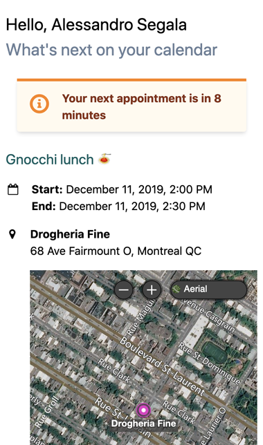

# Next on my calendar - Demo app

This is a demo JAMstack application (JavaScript, API, pre-rendered Markup), showcasing how apps that are completely client-side can have dynamic capabilities by relying on third-party APIs such as those powered by Office 365 and the Microsoft Graph. It also includes the ability to be deployed on the distributed web using the [Inter-Planetary File System](https://ipfs.io) (IPFS).

> Learn more: [Your next app might not have a backend](https://withblue.ink/2019/11/16/your-next-app-may-not-have-a-backend.html)

This demo apps shows what's the next event in your Office 365 calendar.

## See this app in action

This app is live on [next.italypaleale.me](https://next.italypaleale.me).<br />
You will need an Office 365 "Work or school" account to authenticate, which is usually connected to an Office 365 Business/Enterprise or Education. Personal Microsoft Accounts (e.g. Outlook.com/Hotmail) are not supported by this demo app.



## Building the app

In order to build the app, you'll need to set up a few things.

### 1. Clone the source code

Clone the repo and install the dependencies from NPM:

````sh
git clone https://github.com/ItalyPaleAle/calendar-next-demo
npm ci # or `npm install`
````

### 2. Get a Bing Maps API key

Get a free API key for using Bing Maps, which we'll use to show locations on a map.

> Full instructions in the [documentation](https://docs.microsoft.com/en-us/bingmaps/getting-started/bing-maps-dev-center-help/getting-a-bing-maps-key)

1. Navigate to [www.bingmapsportal.com](https://www.bingmapsportal.com/) and sign in with a Microsoft Account (or use your GitHub account).
2. From the top navbar, choose "My Account" then "My Keys"
3. Click on "Click here to create a new key"
4. Fill in the form:
    - Application name: Any value you want
    - Application URL: Leave empty
    - Key type: Select "Basic"
    - Application type: Select "Dev/test"
5. After saving, you'll have a new **Bing Maps API key**: copy that, as we'll need it later

### 3. Create an OAuth app for Microsoft Graph

You'll also need a (free) OAuth application to connect to the Microsoft Graph and the Office 365 APIs.

> Full instructions in the [documentation](https://docs.microsoft.com/en-us/graph/auth-register-app-v2)

1. Sign in to the Azure Portal at [portal.azure.com](https://portal.azure.com), for example using your GitHub account. You **do not need** an Azure subscription for this.
2. Search for "Azure Active Directory" (e.g. using the search bar at the top)
3. In the left blade, under "Manage", look for "App registrations"
4. Register a new application:
    - Name: "Next on your calendar", or any value you want
    - Supported account type: Enable only Work and school accounts (the app doesn't support personal Microsoft accounts at this point)
    - Redirect URI: Choose "Web", then set `https://ipfs/null` (the CI will automatically update this later on)
5. After creating the app, from the information blade copy the value for **Application (client) ID**, which we'll need later.
6. In the left blade, under "Manage" select "Authentication"
    1. Add a new Redirect UI of type "Web" pointing to `http://localhost:3000`
    2. In the "Implicit grant" section, check both boxes to enable the implicit grant for "Access tokens" and "ID tokens" (both). We need to do this because our app is a SPA without a backend server.
    3. Save the changes
7 . In the left blade, under "Manage" select "API permissions"
    1. Click on "Add a permission"
    2. Select "Microsoft Graph"
    3. Select "Delegated permissions"
    4. Ensure that the following permissions are selected:
        - `openid`
        - `profile`
        - `User.Read`
        - `Calendars.Read`
    5. Click on "Add permissions" to save

> If you're encountering issues, you can edit the Manifest file directly, ensuring that the following keys are set to these values (replacing previous values for those keys, if present):
> 
> ````json
> "requiredResourceAccess": [
>     {
>         "resourceAppId": "00000003-0000-0000-c000-000000000000",
>         "resourceAccess": [
>             {
>                 "id": "37f7f235-527c-4136-accd-4a02d197296e",
>                 "type": "Scope"
>             },
>             {
>                 "id": "14dad69e-099b-42c9-810b-d002981feec1",
>                 "type": "Scope"
>             },
>             {
>                 "id": "465a38f9-76ea-45b9-9f34-9e8b0d4b0b42",
>                 "type": "Scope"
>             },
>             {
>                 "id": "e1fe6dd8-ba31-4d61-89e7-88639da4683d",
>                 "type": "Scope"
>             }
>         ]
>     }
> ],
> "oauth2AllowIdTokenImplicitFlow": true,
> "oauth2AllowImplicitFlow": true,
> "signInAudience": "AzureADMultipleOrgs",
> ````
> 

### 4. Create a .env file

Create a `.env` file in the project's folder with the following values:

````sh
# Replace with the "Application (client) ID" value copied earlier
AUTH_CLIENT_ID=00000000-0000-0000-0000-000000000000

# Replace with the Bing Maps API key
BING_MAPS_KEY=xxx

# Leave the following values as is
AUTH_ISSUER=https://login.microsoftonline.com/{tenant}/v2.0
AUTH_URL=https://login.microsoftonline.com/organizations/oauth2/v2.0/authorize?client_id={clientId}&response_type=id_token%20token&redirect_uri={appUrl}&scope=openid%20profile%20User.read%20Calendars.read&nonce={nonce}&response_mode=fragment
GRAPH_ENDPOINT=https://graph.microsoft.com
JWKS_URL=https://login.microsoftonline.com/organizations/discovery/v2.0/keys
````

### 5. Run the app locally

You can now launch the app locally with:

````sh
npm run dev
````

You can now view the app at [http://localhost:3000](http://localhost:3000)

### 6. Build the app for production

Run:

````sh
npm run build
````

The "compiled" app will be in the `dist/` folder. That is your full SPA, and you can deploy those files anywhere you want!

## Publish on IPFS

In order to publish on IPFS, you need to have a running IPFS node. For testing, you can use your own laptop; however, in production it's recommended to maintain at least one server running IPFS 24/7 and seeding your app (and any other content you want to seed)!

> This is a simplified list of instructions. Check out this [blog post](https://withblue.ink/2018/11/14/distributed-web-host-your-website-with-ipfs-clusters-cloudflare-and-devops.html) for more detailed instructions, including setting up an IPFS cluster with 3 nodes for high availability.

### Run the IPFS daemon (using Docker)

The easiest way to run the IPFS daemon is to use Docker. You'll need a Linux VM with Docker installed.

> You can get a free Linux VM with an [Azure trial account](https://azure.microsoft.com/free/open-source/)

After having installed Docker, run:

````sh
sudo docker run \
  -d \
  --restart=always \
  --name=ipfs-node \
  -v /data/ipfs:/data/ipfs \
  -v /data/ipfs-staging:/staging \
  -p 4001:4001 \
  ipfs/go-ipfs:release
````

Wait a few seconds for the daemon to start, then tell IPFS to apply the "server" profile for best performance:

````sh
sudo docker exec \
  ipfs-node \
    ipfs config profile apply server
````

**Note:** if you have a firewall in front of your VM, ensure that port `4001/tcp` is open for incoming connections from anywhere, or other IPFS nodes won't be able to communicate with your server efficiently.

### Publish the app

After "compiling" the app in the previous step, copy the entire `dist/` folder to your server via SSH, and place it in the `/data/ipfs-staging` folder (full path should be something like `/data/ipfs-staging/dist`).

Then, run:

````sh
# (Note the path inside the container is just /staging)
sudo docker exec ipfs-node ipfs add -rQ /staging/dist
````

The command will output the multi-hash of the folder, which will look like `QmSV86hY1Qen22aWrLinNrXmhdc7LbvaFFJZW3ooj96XcU`. You can now browse the app using any public IPFS gateway, for example at: `https://gateway.ipfs.io/ipfs/QmSV86hY1Qen22aWrLinNrXmhdc7LbvaFFJZW3ooj96XcU`

## Continuous Integration and Continuous Delivery

TODO:

- VM connection
- Creating the Service Principal for modifying the app
- Cloudflare DNS setup
